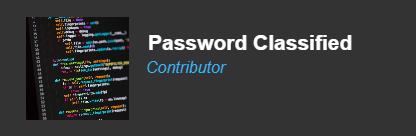

<section align="center">
    <h1>Hello There! &nbsp&nbsp&nbsp</h1>
     
    

        Hi there! I am an enthusiast in machine and deep learning, quantum computing and robotics, mainly a user of Go and Python. I am currently working on...
        <ul>
        

         
            <li>📈 Stock Search: An innovative new way to view stocks - into the past and forward, to the future.</li>
            <li>💻 Multiple programming languages.</li>
            <li>🤖 ChatBrain: An intelligent AI chat bot with a diverse response vocabulary.</li>
            <li>▶️ Language Runner extensions for VS Code</li>
            <li>🎨 CSS Templates for quicker webdev styling.</li>
            <li>🧠 easyNeuron - A brand new Python neural network module.</li>
        </ul>
         

## 💬 Ask me about ...

- My main expertise or knowledge is data science, machine and deep learning
- I am happy to help on any issues on backpropagation or any other neural network aspects when writing from scratch, since I found issues with finding efficient explanations when I began learning about it.

 
 

## 📫 How to reach me ...

- Use the discussions on my **"password-classified"** repository, where this is from.
- Raise issues or discussion topics on my repositories on any specific linked issue/query.
    

     
    

    <h2>Technologies I use...</h2>
     
    

    
    
    
    <a href="https://www.tensorflow.org/">
    <a href="https://www.scikit-learn.org/">
    
    
    
    
    
    
    
    
    
    
    
    
    
    
    
    
    

     
    

    <h2>What I'm Learning...</h2>
     
    

    
    
    
    

     
    

    

    
    
    
    
    
    

     
    <h2>Find me on...</h2>
     
    

    
    
    

     
    

     
    <h2>My stats...</h2>
     
    

    
    
    
    

</section>